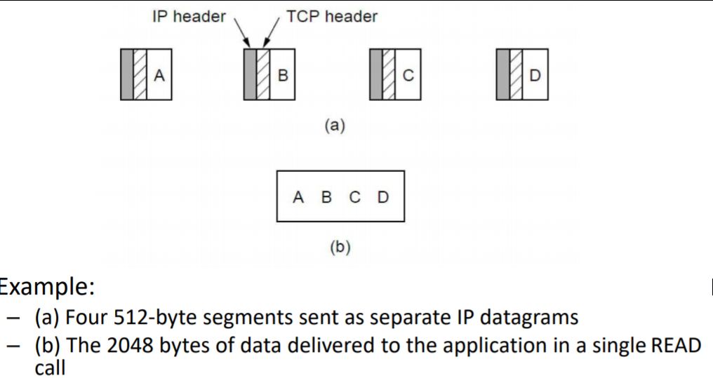
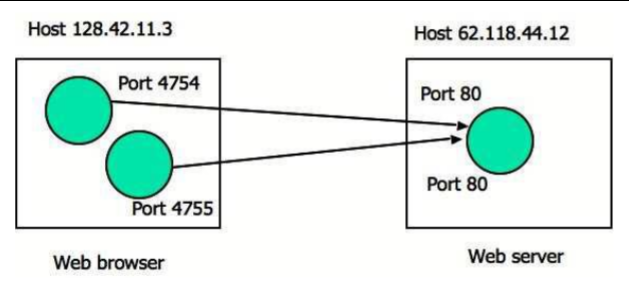
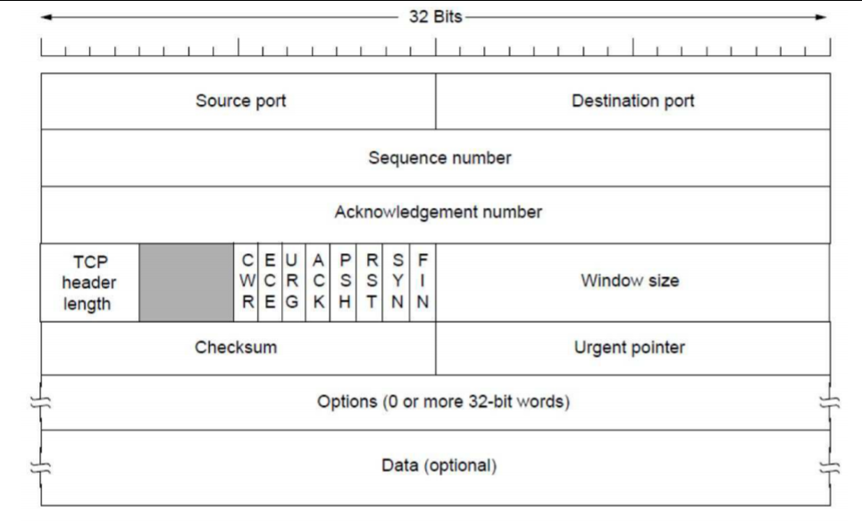
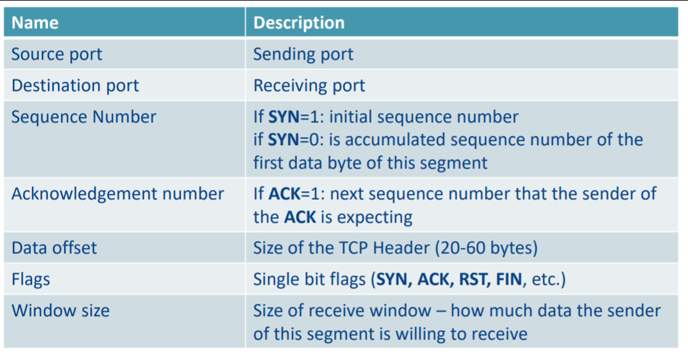
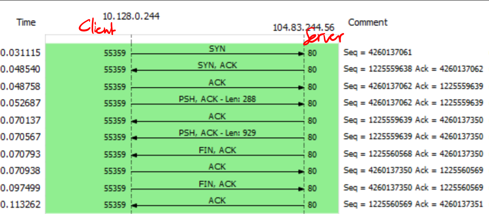

# Computer Systems - Lecture 7 - Transmission Control Protocol (TCP)

### Recap of the Transport Layer
- Provide a **reliable** *cost effective* *data transport* from source to destination
- Provide *interfaces* between the application layer/network layer

**Encapsulation**:
- Abstract representation of messages sent to and from transport entities
- Literally the same as the UDP encapsulation
- Encapulation of segments

**Services**:
- Same as UDP

### Primitives:
- Core functions which allow *interface with transport services*
```
Primitive 			| Packet Sent 		| Meaning
LISTEN				| (none)			| Block until something tries to connect (can timeout this)
CONNECT 			| CONNECTION REQ	| Actively attempt to connect
SEND 				| DATA 				| Send information
RECEIVE 			| (none) 			| Block until DATA packet arrives
DISCONNECT 			| DISCONNECTION REQ	| This side wants to release connection
```

### Connection Establishment Issues:
- TCP is a *connection oriented* protocol running on top of the *connectionless* IP protocol 
- Can result in many *issues*:
	- Congested networks (delayed ACKs)
	- Multiple repeated transmissions
	- Delayed duplicates (things arriving in the wrong order or not at all)
	- much spaghetti

### TCP Overview
- Provides a protocol by which applications can transmit IP datagrams within a framework thus increasing reliability
	- If you want to send a large file it'll split it into things
	- It'll segment literally everything via data streams and then split them into pieces and sends them individually
	- You can have extra *thicc* segments if you're not using ethernet
- Recipient TCP entities reconstruct the original byte streams 

**visual representation**


### Service Model
- The sender and receiver both create "*sockets*" consisting of the *IP address of the host and a port number*
	- For TCP service to be activated, connections must be explicitly established between a socket at a *sending host* and a socket at a *receiving host*

Even in the same host there may be more connections depending on the client ports



If you're both using the same port number i.e. SSH then there will be one connection (even if you both instantiate at the same time)

### Features of TCP Connections
TCP connections are:
- Full duplex (bidirectional)
- Point to point (must have *exact pairs of senders/receivers*)
- Byte Streams (not message streams)
	- A length of a operation will be measured in bytes
- Buffer capable - TCP can choose to buffer prior to sending
	- To benefit efficiency (instead of trying to pass lots of tiny messages, wait for a bigger message)
	- **PUSH** flag (don't buffer me **reee*EEEE***)
		- Put on things that should be sent ASAP e.g. last segments of files
	- **URGENT** flag - Should be sent immediately
		- Not really used (also really vaguely specified)
		- will **not be examined**

### TCP Properties
- Data exchanged is in segments
- Segment has a header of *20-60 bytes + Zero or more data bytes*
- TCP Entities decide how large segments should be within 2 constraints, namely:
	- 65515 byte IP payload
	- Maximum Transfer Unit (MTU) - generally 1500 bytes
		- <sub>probably an ERC20 token :thinking:</sub>  
- *Sliding Window Protocol*
	- to do with congestion and flow control
	- Until the segment has been explicitly acknowledge it remains available to be restransmitted




**Some important TCP headers**


SYN - Synchronise

ACK - Acknowledgement

FIN - finish

RST - reset

### Three Way Handshake
- Ensure packet lifetimes are bounded
- Assign sequence numbers that will not be reused within a packet lifetime
- Ensure initial send/receive sequence numbers are agreed at start of connection

Three Way Handshake


a) Normal Operation
b) Simultaneous Connection attempts (both end up connecting anyway)

### Synchronisation
- SYN flag is used for synchonization during connection establishment
	- Sending SYN of FIN causes sequence number to be incremented
- Sequence Number - first byte of this segments payload
	- Offset by a random number
- Acknowledge Number - next byte the sender expects to receive
	- Bytes received without gaps - a missing segment will stop this incrementing even if later segments have been received

**SYN** and **ACK**:
- Connection request has SYN=1, ACK=0
- Connection *reply* has SYN=1, ACK=1

### Wireshark example

In the time delay at 0.05 to 0.07 it goes up to the application layer

This is HTTP1 where it is *inefficient* as it *closes every connection*

10 messages - each has a 20 byte header

6 messages are only just opening/closing connection

This is why in HTTP1 we have pipelining. 
A huge amount of data would be spent just opening/closing things.

### TCP retransmission
- Each segment has an associate retransmission timer
	- Initialised with a default value and updated based on network performance
	- If the timer expires before an ack is received te segment is resent
	- *This is literally ping in videogames*
- Receives segment with a sequence number higher than expected
	- This is a dupllicate of the previously sent acknowledgement (dupACK)
	- After receiving 3 dupACKs the sender resends the lost segment
	- This is known as fast retransmission 

### TCP Closing
- The **FIN** flag is used to signify a request to close a connection
- Each **FIN** is directional - both must say yes to closing it
- Can be resent after not getting an ACK, FIN
- Typically requires *4 segments* to close, 1 FIN and 1 ACK for each direction
- Can be optimised: Host A send FIN request, Host B responds with both ACK (to A's FIN) and FIN and A sends ACK back

- Can be *hard closed* by **RST** flag
- Basically states sende is closing and will not listen for any further messages
- Can be used to close a connection but **FIN** is preferred cause it's an orderly shutdown

### DDoS'ing with SYN
SYN Flooding
- Keep sending random initial sequence numbers
	- Start a bunch of connections
	- Mapping all these sequence numbers would take up all the space in the serever
	- Never send the ACK, OR, send the ACK after a long amount of time

SYN cookies counter this
- Hash the sequence number and only reserve space if the client sends the correct hash back
- Incurs *performance cost* but better than being unresponsive