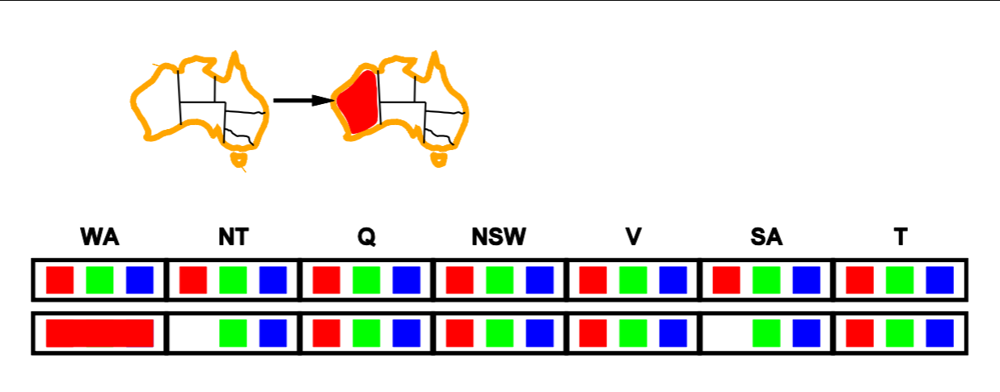
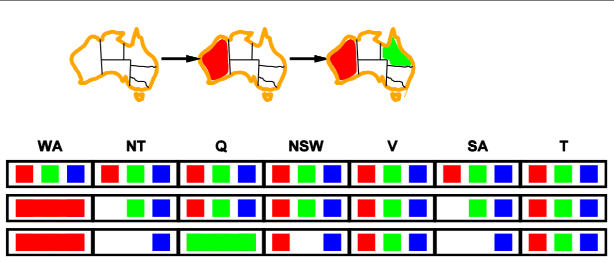
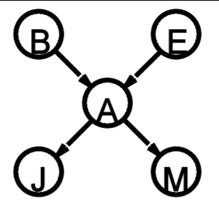
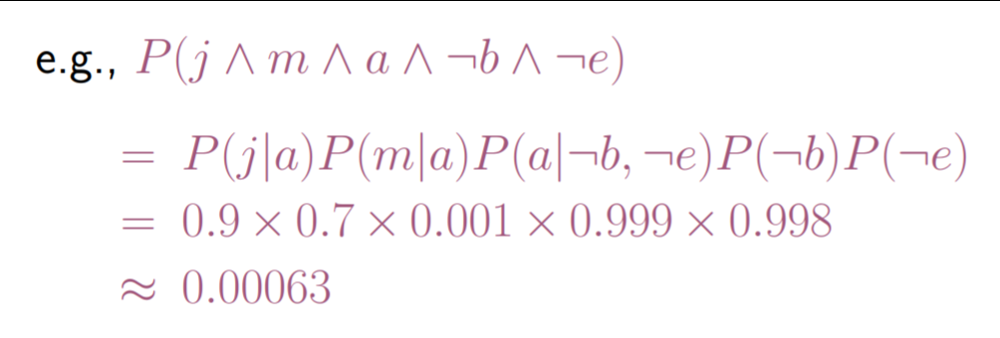
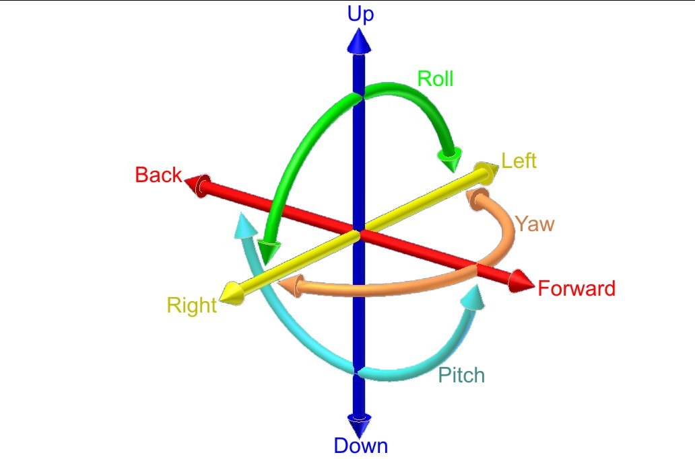

# What’s in the Exam???
- Worth 70 marks - 7 questions 10 marks each
- 3 hours
- 35 mark hurdle
- Half of subject on Symbolic AI and half on Probabilistic AI
- 2-3 sentence answers

## Week 1: What is AI? Intelligent Agents
##### Explain different approaches to defining AI
- Thinking like a human
- Thinking rationally
- Acting like a human
- Acting rationally

##### Describe the operation of the Turing test
- A person talks to a computer via typing
- Computer has to *imitate a human well enough to fool the other guy*

##### Characterise the difficulty of different common tasks
- Semantic understand is hard
- Maths related things are easy
- Conversational agents are hard

##### Characterise requirements for an agent in terms of its percepts, actions, environment and performance measure
- Has to *take inputs* i.e. **sensors**
- Has to *do actions which change the environment* with **actuators**
- Has to exist in an **environment**
- Has to *evaluate its current state* and have a **performance measure** *of the desirability of the state*
- Just remember **PEAS**
	- **Performance Measure**
	- **Environment**
	- **Actuators**
	- **Sensors**

##### Characterise the environment for a given problem
- **Fully vs Partially Observable**
	- Can you see all relevant info?
- **Deterministic vs Stochastic**
	- Is there a chance for your choice to fuck up or is it *certain that your move determines the next*
- **Episodic vs Sequential**
	- *Does your environment change at all*?
- **Static vs Dynamic**
	- Does your *environment change while you're thinking/deciding*?
- **Discrete vs Continuous**
	- Is there a *finite number of moves*? 

##### Choose and justify choice of agent type for a given problem
- **Simple Reflex Agents**
	- simple boi
	- if x do y
- **Model Based Reflex Agents**
	- Has a current *internal representation of the world*
	- Uses a lot of memory
	- Decides things based on current state
- **Goal Based Agents**
	- Contains *future predicted states of the world*
	- Has a *goal to achieve*
	- Decides things based on current/future predictions
- **Utility Based Agents**
	- Same as above but *has utility values*
	- Tries to *maximize happiness*
- Make a decision **based on the environment**
	- Don't use something too complex

## Week 2: Problem Solving and Search 
##### Formulate single state search problem
- **Formulate a Problem**:
	- Consider the **current state** and **goal state**
	- Consider the **operations we can do to change state**
	- e.g. drive from southbank to unimelb
		- States: Southbank, Unimelb
		- Actions: Drive
- A **solution** is considered a **sequence of actions** leading from the **initial state** to the **goal state**
	- We **measure how good a solution is** by using **path cost**

##### Analyse complexity of a search strategy
##### Apply a search strategy to solve problem
- **BFS**
	- Expand breadth wise
	- **Complete**
	- *Time:* **O(bd)**
	- *Space:* **O(bd)**
	- **Optimal Path**
- **DFS**
	- Expand depth wise
	- **Not Complete if in Infinite Space**
	- *Time:* **O(bm)**
	- *Space:* **O(bm)**
	- **Not Optimal Path**
- **Uniform Cost Search**
	- Expand least-cost node
	- **Complete if step size > 0**
	- *Time:* **n nodes g cost <= optimal cost**
	- *Space:* **n nodes g cost <= optimal cost**
	- **Optimal**
- **Depth Limited Search**
	- Do depth first to a certain limit
	- **Not Complete**
	- *Time:* **O(bl)**
	- *Space:* **O(bl)**
	- **Not Optimal**
- **Iterative Deepening Search**
	- Do DFS for each 'step'
	- **Complete**
	- *Time:* **O(bd)**
	- *Space:* **O(bd)**
	- **Optimal if step size = 1**
- **Bidirectional Search**
	- Search from both goal and start
	- **Complete**
	- *Time:* **O(bd/2)**
	- *Space:* **O(bd/2)**
	- **Optimal**

## Week 3: Informed Search Algorithms 
##### Demonstrate operation of search algorithms

##### Discuss and evaluate the properties of search algorithms
- **Greedy Best First Search**
	- Go down the path that seems to be as close as possible to the end
	- **Not Complete (needs repeated state checking)**
	- *Time:* **O(bm)**
	- *Space:* **O(bm)**
	- **Not Optimal**
- [**AStar (A\*) Search**](https://qiao.github.io/PathFinding.js/visual/)
	- Avoid expanding paths that are already expensive
		- Keep an ordered list of the f(n) cost of things
		- Expand the next one
	- Evaluate things with:
		- f(n) = cost so far to reach n (g(n)) + estimate cost to goal from n (heuristic h(n))
	- Similar to Uniform Cost search but evaluating distance from the goal
	- **Complete**
	- *Time:* **Exponential in [relative error in h * length of soln]**
			- **Expands similarly to breadth first so O(berror\*d)**
	- *Space:* **O(bd) all nodes in memory**
		- **Optimal**

##### Don’t forget about iterative improvement algorithms

##### Derive and compare heuristics for a problem e.g., is a given heuristic h1 admissible; for given heuristics h1 and h2, does h1 dominate h2
- Heuristics is the *h(n)* part of the AStar evaluation
- An **Admissible heuristic** is when the **heuristic value is always lower than the cost of getting to the goal**
	- If a **heuristic is admissible** then **it will always find a path to the goal**
	- If a **heristic is _not_ admissible** then **it may not find an optimal path to the goal but it will _do it faster_**
- A **heuristic dominates another** when **all of it's values for the same input are higher than the other's**
	- h1(n) >= h2(n) for *all of n*

## Week 4: Game Playing and Adversarial Search
##### Design suitable evaluation functions for a game 
- Evaluate games as a search problem
	- Initial State
	- Actions
	- Terminal Test (win/lose/draw)
	- Utility Function
		- e.g. chess: +1, 0, -1
		- poker: cash one or lost

##### Discuss and evaluate the properties of game search algorithms 

##### Demonstrate operation of game search algorithms e.g., which nodes will be pruned under given node order or optimal node ordering in a given search tree 
- **Minimax**
	- Check all possible moves for their value up to a certain level
		- Calculate our value with a heuristic similar to AStar
		- **Maximize our utility value when it's our turn**
		- **Minimize enemy utility value when it's not**
	- Absolutely **perfect play** with **infinite lookahead**
	- **Complete**
	- **Optimal (against another optimal opponent)**
	- *Time:* **O(bm)**
	- *Space:* **O(bm)**
- [**AlphaBeta Pruning**](http://homepage.ufp.pt/jtorres/ensino/ia/alfabeta.html)
	- Do the same as minimax, but every time you find a new minimum/maximum, keep track of it and discard values that are under/over this value
		- Calculate our value
		- If our current lowest MIN value is 3 and we find a 2 while minimizing, set the new lowest MIN value to 2 and discard the rest of the branch
		- Basically imagine you're pruning a tree to the shortest/longest branch
	- **Not Complete**
	- **Optimal since it results in the same thing**
	- *Time:* **O(bm/2) with perfect ordering**
	- *Space:* **Same as time?**
- Quiescence Search
	- Find a cut-off depth in minimax

##### Explain how to search in nondeterministic games e.g., demonstrate operation of ExpectiMinimax 
- **Expectiminimax**
	- Minimax but before every outcome you add a "chance node" which applies a probability to it
	- Tree grows really fast
	- As depth increases probability of reaching a node becomes diminished
		- Means we care less about really *deep nodes*

## Week 5: Machine Learning in Game Search
##### Discuss opportunities for learning in game playing 
- **Can use machine learning in AI** when we **have an algorithm with weighted features**
- **Gradient Descent Learning**
	- *Error*: ^{2})
	- *Weight Update Rule*: 
	- Keep making small changes in weight until **we reach a global minimum error value**
	- Hard to balance the n learning rate variable
		- Too big = May miss the global minimum
		- Too small = Gets stuck in a local minimum and it takes forever
- **Problems with Machine Learning:**
	- **_Delayed Reinforcement_**: It takes a while before we get feedback
	- **_Credit Assignment_**: We don't know *what actions* resulted in the outcome

##### Explain differences between supervised and temporal difference learning 
- **Supervised Learning**:
	- Single step prediction
	- Predict tomorrow
- **Temporal Difference Learning**
	- Multi-step prediction
		- Predict tomorrow and the day after etc. 
	- Delayed feedback
	- Hope we're doing this right lol

##### Not expected to derive or memorise the TDLeaf(λ) weight update rule, but if given this rule may ask you to explain what the main terms mean 
- **TD Leaf**: ![\large w_{j} \leftarrow w_{j} + \eta \sum_{m=1}^{N-1} \frac{\partial r(s_{l}^{i}, w)}{\partial w_{j}} \[\sum_{m=1}^{N-1}\lambda^{m-i}d_{m}\]](https://latex.codecogs.com/gif.latex?w_{j}&space;\leftarrow&space;w_{j}&space;&plus;&space;\eta&space;\sum_{m=1}^{N-1}&space;\frac{\partial&space;r(s_{l}^{i},&space;w)}{\partial&space;w_{j}}&space;[\sum_{m=1}^{N-1}\lambda^{m-i}d_{m}])
- wj: *Current weight*
- di: *Error*
- η: *Learning rate*
- λ = 0: *weights move towards the predicted reward* at **next state** (i.e. move towards r(si+1, w)) **using only the next state**
- λ = 1: *weights move towards* the **final true reward** (i.e. move towards r(sN)) **using all states**
- }{\partial&space;w_{j}}): How **_reward_ is changing with respect to _weight_**
- ![\large \[\sum_{m=1}^{N-1}\lambda^{m-i}d_{m}\]](https://latex.codecogs.com/gif.latex?[\sum_{m=1}^{N-1}\lambda^{m-i}d_{m}]): **Weighted Sum of Error**

## Week 6: Constraint Satisfaction Problems
##### Model a given problem as a CSP 
- A *CSP* has **three main parts**.
	- **_X_ set of _variables_**: {X1... Xn}
	- **_D_ set of _domains_ for _each variable_**: {D1...Dn}
	- **_C_ set of _constraints_ that must be fulfilled**
		- Can be **unary** (itself), **binary** (2 variables) or **higher order/tertiary** constraints (multiple variables e.g. all different values)
		- A *goal test* is defined by these constraints
- Model a problem in terms of these:
	- e.g. classic lecture scheduling problem
	- X would be *lectures*
	- D would be *times available*
	- C would be *all times different for each lecture i.e. allDiff*

##### Demonstrate operation of CSP search algorithms 
- **Backtracking Search**
	- Depth first search by assigning each domain value to each of variables
		- Literally *takes forever*
		- Ends up making _**n!dn**_ leaves! *Insanity.*
- **Forward Checking**
	- Whenever you **assign a variable**, **remove this value from any neighbours**	
		- e.g. for the australia state colour problem:
			- We assign *RED to WA*:
			- 
			- This results in *RED being removed from NT and SA*
			- Now we assign *GREEN to Q*:
			- 
			- Continue till we _reach a point where there is **no domain left for a variable**_ 
			- 
		- Complexity *depends on whatever order you check variables/values*
		- It could be _**O(dn)**_
- **Arc Consistency (AC-3)**
	- **Start from a queue of arcs** and **check each node at each arc** whether they share any **values/domain in common**
		- If they **do have a conflict**, **add all arcs from that node to the queue to check again later**
		- **Keep going** until **the queue is empty** (i.e. the **graph is consistent** and **there are no conflicts**)
	- *Time Complexity:* _**O(n2d3)**_
		- Can be reduced to _**O(n2d2)**_ with a good heuristic/ordering
	- This *checks for conflicts*
	- You should *do this before backtracking search*

###### e.g., in what order are variables or values chosen using minimum remaining values, degree heuristic, least constraining value
- **Variable Ordering**
	- **Minimum Remaining Values**
		- Pick a variable **with the least number of remaining legal values (i.e. smallest domain left)**
			- e.g. WA has *only RED left*, so we assign WA first
				- *Reduces the number of choices for other variables*
			- 
	- **Degree Heuristic**
		- Pick the variable which **has the most number of constraints on other values**
			- e.g. we start with SA since it constraints literally every other state lol
			- 
			- Can be used as a tiebreaker for minimum remaining values
- **Value Ordering**
	- **Least Constraining Value**
		- Pick the value for the variable **which removes the least number of values from its neighbours**
		- 

###### e.g., show how the domain of values of each variable are updated by forward checking, or arc consistency, where X → Y means using arc consistency to update domain of X so that for every value x ∈ X there is some allowed value y ∈ Y 
- See above

##### Discuss and evaluate the properties of different constraint satisfaction techniques
- **Tree Structured CSP**
	- Make a variable a root node
	- Go down the tree and apply `makeArcConsistent(Parent(Xj) Xj)` to all nodes
	- If you're at the deepest point, assign X so that it is consistent with it's parents
	- *Best Case Time Complexity*: Tree can be solved in _O(nd2)_ i.e. linear time 
		- You **only need to take into account 2 nodes at any one time since removing a domain value from a node _will not impact its other children_ d2**
		- If there *are loops* then you need to account for those with the below: 
	- *Worst Case Time Complexity*: _**O(dn) i.e. Tree with Loops**_ 
- **Nearly Tree Structured CSP**
	- We can use **Cutset Conditioning**
	- **Conditioning**: instantiate a *variable* and *prune its neighbours' domain* values
	- **Cutset**: *set of variables that can be deleted* so constraint *graph forms a tree*
	- **Cutset conditioning**: *instantiate (in all ways) a set of variables such that the remaining constraint graph is a tree*
		- 
		- Then we can apply the above technique
	- *Time Complexity*: where **c is the cutset size** -> _**O(dc(n-c)d2) basically remove the variables which make the tree a loop with dn and then use the tree time complexity nd2**_

## Week 8: Making Complex Decisions

##### Compare and contrast different types of auctions 
- Auctions have *3 main dimensions*:
	- **Winner Determination**: Which bidder wins and what do they pay?
		- *First price auctions*: highest bid is paid
		- *Second-price auctions*: second highest bid is paid
	- **Knowledge of Bids**:
		- *Open cry*: Every bidder can see all bids from all other bidders
		- *Sealed*: Every bidder can’t see the other bids
	- **Order of bids**:
		- *One-shot*: each bidder can only make one bid
		- *Ascending*: each successive bid must exceed the previous bid
		- *Descending*: start from a high price and go down and the first to bid wins
- *Mechanism for an auction consists of*:
	- a **language** to describe the allowable strategies an agent can follow
	- a **communication protocol** for communicating *bids from bidders to the auctioneer*
	- an **outcome rule**, used by auctioneer to *determine the outcome*
		- **when to stop** the auction
		- **who’s the winner**
		- **how much they have to pay**

##### Describe the properties of a given type of auction
- **English**
	- Start low and keep open-cry bidding higher
	- **Efficient**
	- **Susceptible to the winner's curse**
	- **Susceptible to collusion**
- **Dutch**
	- Start high and go lower until someone open-cry bids
	- **Efficient**
	- **Susceptible to the winner's curse**
	- **Susceptible to collusion**
- **First-Price Sealed-Bid Auction**
	- Everyone bids what they think it's worth once and then the winner pays the highest value
	- **May not be efficient**
		- Since person who values it the most may not win
	- **Susceptible to the winner's curse**
	- **Not susceptible to collusion**
	- **Easier to communicate**
- **Second-Price Sealed-Bid (Vickrey) Auction**
	- Everyone bids what they think it's worth once and the winner pays the second highest value
	- **Efficient and Truth revealing**
		- Strategy is just to bid your value
	- **Not susceptible to the winner's curse**
		- You aren't paying what you value it
	- **Not susceptible to collusion**
	- **Computational simplicity**
	- **Counter intuitive** for **human bidders**

##### Select the most appropriate type of auction for a given application 
- 

## Week 9: Uncertainty
##### Calculate conditional probabilities using inference by enumeration 
- Inference by enumeration is changing the space in which the probability is taken from

##### Use conditional independence to simplify probability calculations
- **A and B are independent** iff
	- `P(A|B) = P(A) or P(B|A) = P(B) or P(A, B) = P(A)P(B)`
	- Also means `P(A|!B) = P(A) and etc.`
- This means **if _A and B are independent_** then we can **simplify P(A|B,C)**
	- Since `P(A|B) = P(A)` then **`P(A|B,C)` becomes `P(A|C)`**
	- Also `P(A, B|C) = P(A|C)P(B|C)` since `P(A, B) is P(A)P(B)`
- Now we can simplify complex things such as *full joint distribution using chain rule*
	- *Given A and B are independent* `P(A, B, C)` would *normally have 23-1 entries*
	- Reduce it by using the above rules + *chain rules*
		- `Chain Rule: P(X1, X2, X3, X4) = P(X4 | X1, X2, X3)`
		- `P(A, B, C) = P(C|A, B) P(A, B)`
		- `P(A, B, C) = P(C|A, B) P(B|A) P(A)`
		- `P(A, B, C) = P(C|A) P(B|A) P(A)` = 2 + 2 + 1 = 5 entries vs 7

##### Use Bayes’ rule for solving diagnostic problems 
- `P(A|B)P(B) = P(B|A)P(A)`
- Solve this into
	- `P(A|B) = P(B|A)P(A)/P(B)`

###### Note: if the arithmetic is too complex to compute the exact final value then simplify the expression as best you can

## Week 10: Bayesian Networks
##### Formulate a belief network for a given problem domain
- Basically form a graph where causal nodes lead to symptomal modes
	- Causes -> Symptoms
- A grandfather node *should be independent of it's grandchildren*

##### Derive expression for joint probability distribution for given belief network 
- Look at [Uncertainty](#use-conditional-independence-to-simplify-probability-calculations)
- This is can be done with **global semantics**:
	- Defines a **full joint distribution** as the product of the *local conditional distributions*
		- 
		- Applying this to : 
		- 
	- **Local semantics**: *each node is conditionally independent* of its nondescendants *given its parents*

##### Use inference by enumeration to answer a query about simple or conjunctive queries on a given belief network 
- **Simple Query**:
	- Simply calculating a probability from posterior marginals
	- e.g., P(NoGas|Gauge = empty, Lights = on, Starts = false)
- **Conjunctive Query**:
	- Breaking a query into smaller queries using the chain rule:
	- P(Xi, Xj|E = E) = P(Xi|E = E) P(Xj|Xi, E = E)

## Week 11: Robotics 
##### Determine the number of degrees of freedom of a robot, and whether it is holonomic 
- Degrees of freedom: Basically **how many different ways can we "move"**
	- You need *6 degrees of freedom* to move around without restrictions *in 3d space* (*3 for position* and *3 for rotation*)
	- 
- Something is **non-holonomic** when it **has more degrees of freedom** than **controls**
	- For example a **_car is non-holonomic_ because has 2 controls** but has **3 degrees of freedom**
		- Since it **can rotate in the x axis** and we **can accelerate/decelerate in the x axis** but **we _cannot accelerate/decelerate in the y axis_**

##### Characterise sources of uncertainty in a robot application scenario 
- *Examples of Sources of Uncertainty in Robots*:
	- **Perceptions (incorrect sensing)**
		- *Incorrect sensors*
		- *False positive/negative*
		- *Limited/Finite Time*
		- *Partially Obstructed Environment*
	- **Actions (incorrect doing)**
		- *Rough Surfaces*
		- *Obstacles*
		- *Slippage*
		- *Inaccurate Joint Encoding*
		- *Injuries (Effective Breakdown)*

##### Explain the basic concepts of localisation and mapping 
- Basically we scan our environment and **decide where we can't go**

##### Formulate an application problem using incremental Bayes, and calculate posterior probabilities 
- Tutorial 11
	- Basically re-calculating P(+) when calculating P(o|++)

##### Model the configuration space for a simple robot 
- Draw where it can't go lol

##### Compare different approaches to motion planning given a particular configuration space 
- **Cell Decomposition**:
	- Break configuration space into *simpler cells*
		- Depends on the *resolution* of the cells
		- Basically like *pixel-izing* our config space so it's finite
	- Inaccurate
- **Skeletonisation**:
	- *Voronoi Diagrams*:
		- We define *limits* around the configuration space
		- Voronoi Diagrams don't scale well
	- *Probabilistic Roadmap*: 
		- Generate random points within configuration space and creating a graph
		- Need to generate enough points to ensure everywhere is reachable