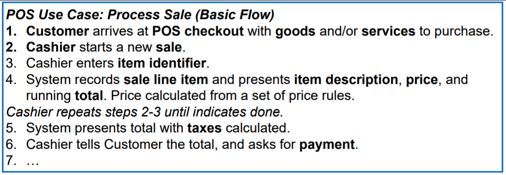
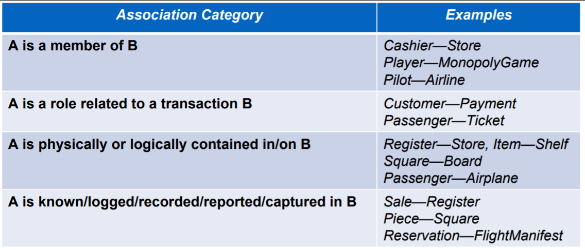
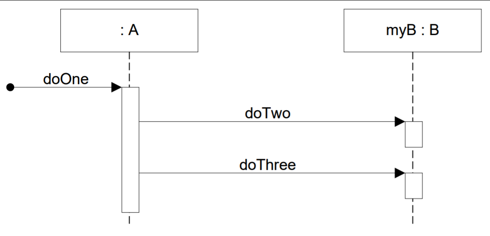
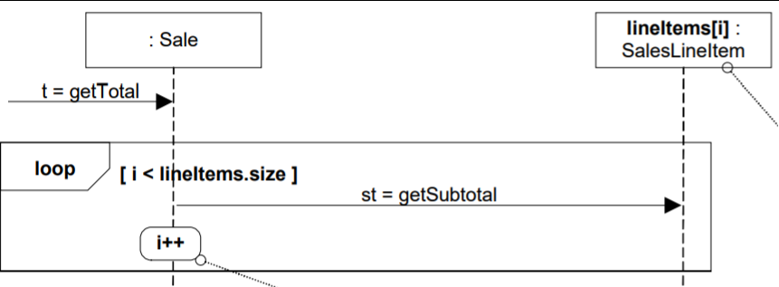
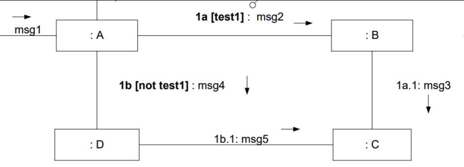
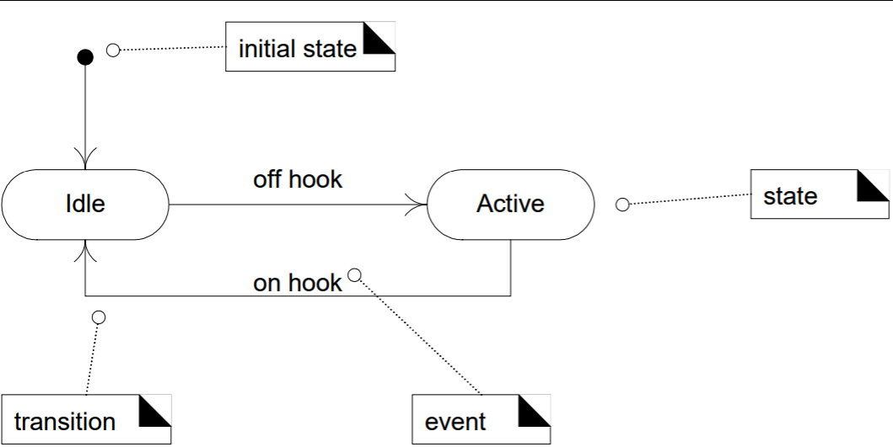
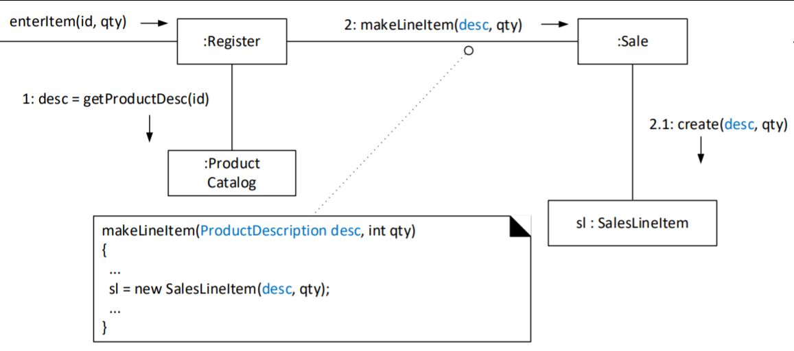
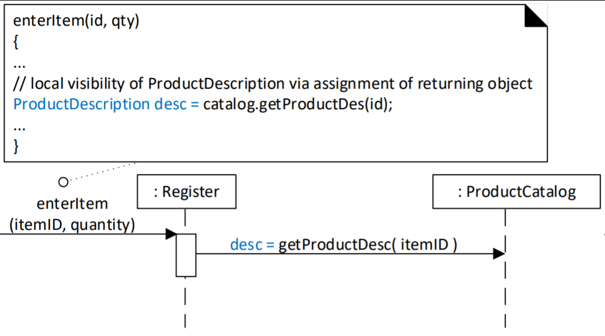
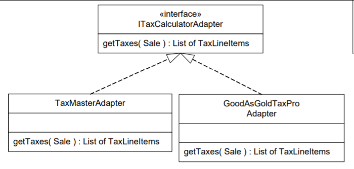

# SWEN30006 Software Modelling and Design

### What is Software Modelling for?
- **Analysis**: Investigation of the problem/requirements
- **Design**: Purposefully choosing the structure and behaviour of your software system
	- The behaviour is *all about how your systems responds to inputs* and events
	- "Alright let's write everything in main()"
- **Modelling**: Creation of tangible but abstract representations of a system so you can communicate ideas
	- "Alright look at my diagram I put everything in one function and now it's faster"
---------------------------------------

### Iterative UP (Unified Process)
- This is the main process of software development considered in this course
	- Requirements -> Design -> Implementation -> Test -> Integrate
	- *Feedback during testing helps the next iteration*
	- Like *rewriting a draft*
	- Iterations are *fixed in length*

- **Definitions**:
	- **SuD**: System Under Discussion
	- **Actor**: Something with behaviour such as a person computer system or organisation
		- **Primary Actor**: Has user goals fulfilled through using the SuD
		- **Supporting**: Provides a service to the SuD
		- **Offstage**: Has an interest in the behaviour of the use case, but is not primary or supporting
	- **Scenario (or use case instance)**: A specific set of actions and interactions between actors the SuD
	- **Use Case**: Text descriptions of an actor using the system to achieve a goal, fail or success.
		- Can be *brief*, *casual*, or *fully dressed*
		- **Boss Test**
			- *Boss*: "What have you been doing all day?"
			- *You*: `<doing use case>`
			- Is your boss happy?
				- No. he never is.
		- **Elementary Business Process Test (EBP Test)**
			- A task performed by one person in one place at one time in response to business event
		- **Size Test**
			- Very seldom a single step; typically many steps.
---------------------------------------

### Domain vs Design Models
- **Domain**:
	- Shows what you are using within a domain
	- Overview of the world
	- Most layman way to explain a problem 
	- Drawing it so that everyone can understand 
	- Has nothing to do with development
	- **No Privacy Modifiers**
	- **No Interfaces/Abstract Classes (i.e. software concepts)**
	- **No Methods**
	- **No Data Types**
- **Design**:
	- Software representation of the problem
	- Discusses objects
	- Not specific to language
	- For a software developer
	- Blueprint of program

### Domain Models
- **_Uses Conceptual Classes_**
	- An 'entity', 'thing' or object irl
	- Combination of a
	- Symbol: Words or images representing class
	- Intension: Definition of class
	- Extension: Set of instances represented by C
- **Create one by**:
	- Finding *Conceptual classes*
	- *Drawing* these in a *UML* class diagram
	- *Adding associations* and attributions
- **Find one by**:
	- *Reusing or modifying existing models* e.g.
		- Standardised/adopted domain model
		- Organisational domain model
	- Use a *category list*
		- Basically a list of definitions that looks like this: 
	- Identify *noun phrases*
		- Make a list of candidate conceptual classes 

### Attributes vs Classes
- We can differentiate between an *attribute* and a *class*
	- If the entity is not considered a number/text value irl, it's probably a conceptual class, not an attribute

### Description Class
- Contains info that describes something else
- *Groups of items share* the same *description*
- *Items need to be described even* when there are currently *no examples*
- *Reduces redundant or duplicated information* (design)
- *Deleting instances results in losing required info* (design)

### Associations
- An **association** respresents some meaningful and significant relationship between classes
- Significant in the domain
- Knowledge of the relaionship needs to be preserved
- Draw an arrow from one class to another
- This can **also be defined by a category list**
	- 
- Associations have _**Multiplicity**_

### Multiplicity
- 
- Defines *how many* of another class is associated with another
- Depends on the scope of our model
	- Do we care about items before/after the store
- Is this a constraint we want to maintain?

---------------------------------------------------------------------------------

### UML Interaction Diagrams
- **Sequence**:
	- Clearly shows times ordering of messages
	- Can more easily convey the detail of message protocols between objects
	- 
- **Communications**:
	- More layout options
	- Clearly shows relationships between object instances
	- Combine to provide a more complete picture
	- 
	
### Sequence Diagrams
- We have *lifelines* which show instances doing things down their "lines"
	- Named with a colon like `:Sale`
	- You can define an *instance of a class* with `s1 : Sale`
	- Interfaces/Abstract Classes can also be defined with `sale : List` where List is an interface/abstract class
	- Arrays/Other data structures are done with the following `sales: ArrayList<Sale>` or `sale[i] : Sale`
- Function calls/events and methods are shown *by solid arrows between lifelines* which are called from a *execution specification bar*
	- A *dotted arrow* shows a **return from a result**
	- Arrows can lead to *new lifelines being created*
	- If an object _is being deleted by a call, it is shown by an **"X"**_
	- A **conditional message** is shown by **`[ condition = true ]`**
- A **loop** can be shown by a **UML frame**

### UML Frames
- This is basically a way of *"encapsulating" operations* such as *loops or conditionds (alts)*
	- This is done by a small box in the top left corner of the frame followed by the condition e.g. `[i < lineitems.size]`
	- 
- This can also be used to refer to "references"
- You can define *polymorphic* classes too by using `Payment {abstract}`

### Communication Diagrams
- Kind of like a node-graph sort of setup 
	- each *node is an instance*
	- every *arc is a function call*
- You can *create instances from a function call by using `create() or <<create>>`*
- *Conditionals* are done the same way, with `[ condition = true ]` brackets
	- Can be mutually exclusive messages if you have two conditions branching off of a instance
	- 
- Static/Class Messages are done by having no colon: `<<metaclass>> Bicycle`
- Iteration is also done like conditions, with `* [i = 1..n]: num = nextInt`
	- Note the **\***
	- The square bracket condition is optional
	- You could do `: st = getSubtotal` for example

-------------------------------------

## GRASP
All about doing things *responsibly*
- General Responsibility Assignment Software Patterns (or Principles):
	- Creator Pattern
	- Information Expert
	- Low Coupling
	- Controller Pattern
	- High Cohesion
	- Polymorphism
	- Indirection
	- Pure Fabrication
	- Protected Variations

### Creator Pattern
- We learnt this in OOSD
- *Class B contains A* and is *responsible for initialising it*
- Gets kinda weird when you have to create different instances based on properties
```java
// Inside our creator class
private SomeObject objectName = null;

// Initialise when created
public Creator() {
	objectName = new SomeObject(property1, property2);
}
```

### Low Coupling
- Make sure classes depend on each other as little as possible
- Coupling is unavoidable but we want to couple where things are stable
- Means stuff is modular and easier to stand by themselves
```java
// If we were in a "player" class
private getSquare() {
	return this.square;
}
// vs. offloading to a different class
board.getSquare();
```

### Information Expert
- The general principle of assigning responsibilities to objects
- Assign things to objects which *"know"* the most about it
- Increases cohesion and reduces coupling
```java
// instead of
private Square s = new Square();

// We pass the responsibility of creating/getting squares to the board class
private Square s = board.getSquare(name)
```

### Controller
- Overall system is run by this controller
- Coordinates the system
- *Delegates events and responses* to lower classes
- May get too *bloated*
	- Too many responsibilities
	- Low cohesion
	- Unfocused
```java
// overall controller class
public doX() {
	lowerClasses.dostuff()
}
public doY() {
	lowerClasses.dostuff()
}
```

### High Cohesion
- How *focused* you keep your objects
- Usually a result of *low coupling*
- A class with high cohesion is easier to understand and maintain
- However low cohesion is sometimes justified to meet performance requirements etc.

### State Machines
- State machine describes the behaviour of an object
	- *Event*: Significant or noteworth occurence
	- *State*: Condition of the object at a moment in time
	- *Transition*: Directed relationship between two states that an event can cause
	- 
- Choices are done with *diamonds* and `[]`
	- 
- You can also do *nested states*
	- Sub states which are state machines in themselves:
	- 
```java
enum State { STATE1, STATE2, FINAL }
State state = State.STATE1;
int lastX;

public void eventA(int x) {
	state = State.STATE2;
}

public void eventB() {
	if (State.STATE1 == state) {
		state = State.FINAL
	}
}
```

### Polymorphism
- Allowing our code to morph in different situations
- Different behaviour/operations with the same interface
- May result in too many objects
- Needs to be balanced with representational decomposition

### Pure Fabrication
- Which object should have responsibility when solutions offered by other patterns violate High Cohesion/Low Coupling
- Make up a class that doesn't actually represent something irl but supports high cohesion/low coupling
```java
// This is like that example of monopoly
// Instead of having 2 dice we'll have a 'cup'
int fvTot = 0;
for (int i < 0; i < dice.length; i++) {
	dice[i].roll();
	fvTot += dice[i].getFaceValue();
}

// To this
cup.roll();
```

### Indirection
- When we assign the responsibility to an immediate object to mediate between the other components or services so that they are not directly coupled
- Higher complexity in design but results in way lower coupling

```java
// making up an adapter
// this is also done with the strategy pattern

public doAThing() {
	// do a thing here
	// and here
	// and more stuff leading to coupling
}

private Adapter thing;
thing.doAThing(); // Where Adapter can be altered to whatever

```

### Protected Variations
- Identify points of known or predicted variation/instability
- Create a stable interface around them

### Open-Closed Principle
- Modules should be *open for extension* but *closed to modification*
- Done with interfaces
- Same thing as protected variations but with different emphasis


-------------------------------
also you can make code from designs lol

-------------------------------

### Visibility
- Four kinds of *visibility* in design
- For A to send a message to B, B must be visible to A
	1. B is an *attribute* of A
		- 
	2. B is a *parameter method* of A
		- 
	3. B is a (non-parameter) *local* object in a method of A
		- 
	4. B has in some way *global* visibility
		- 
- `-` is for private
- `+` is for public
- `#` is for protected

-------------------------------

### Test-Driven Development
- Development where you write the requirements test before  the code
- Ensure production code passes tests before proceeding
- Clarifies software behaviour

### Refactoring
- Rewriting or restricting existing code without changing it's external behaviour
- Fixing your code before submitting it lol
- Removing:
	- Duplicated code
	- Big methods
	- Class with many instance variables
	- Class with lots of code
	- Similar subclasses
	- Little/no use of interfaces in design
	- High Coupling
	- Low Cohesion

-------------------------------

### Software Architecture
- Set of significant decisions about the organisation of a software system
- The *structural elements* and the *interfaces* by which the system is composed
- The behaviour as specified in the collaborations
- The composition of these systems
- The architectural style that guides this organisation

### Logical Architecture and Layers
- The large scale organisation of the software classes into packages, subsystems and layers
- Logical: not concerned with networking, physical computers or operating system processes.

### Layered Architecture
- **Strict**: Layer only *calls upon the services of the layer directly below it*
	- e.g. network protocol stack
- **Relaxed**:
	- A layer calls upon the services in several lower layers

### Designing with Layers
- Organise structure of system into *distinct cohesive layers* from high application specific to low general services
- Collaboration and coupling from higher layers to lower layers


-------------------------------

### Patterns
*"A pattern is a recurring successful application of expertise in a particular domain."*
- Improve Understandability
- Simplify Documentation
- Facilitate generating modified applications
- Make it easier to reuse successful code
- Capture 'expertise' and make it accessible to non-experts in standard form

### Types of Patterns
### Gang of Four
#### Adapter
- Resolve incompatible interfaces or provides a stable interface
- Convert the original interface of a component into another interface through intermediate object


#### Façade Pattern
- Wraps access to a subsystem with a single object
- Like a controller for the whole system
- Front-end
- Who creates the adapters?
```java
public class Sale {
public void makeLineItem( ProductDescription desc, int quantity )
{
SalesLineItem sli = new SalesLineItem( desc, quantity );
// call to the Facade
if ( POSRuleEngineFacade.getInstance().isInvalid( sli, this ) )
return;
lineItems.add( sli );
}
// ...
} // end of class
```

#### Factory (not GoF)
- Simplified GoF Abstract Factory pattern
- Hides complex logic
- Pure fabrication object that handles creation
- Who creates the factory?

#### Strategy
- How do design for varying but related algorithms?
- Define each algorithm in a separate class with a *common interface*
- Used this in Projects
```java
private Strategy strategy = new GoodStrategy();
strategy.run(); // any class that implements Strategy can now have different algorithms
```

#### Composite
- How to treat a group or composition structure of objects the same way as a non-composite object?
- Define classes for composite and atomic objects so that they implement the same interface

### Observer (Publish-Subscribe)
- Define a subscriber or listener interface.
- Subscribers implement this interface.
- Publisher can dynamically register subscribers who are interested in an event and notify them when an event occurs